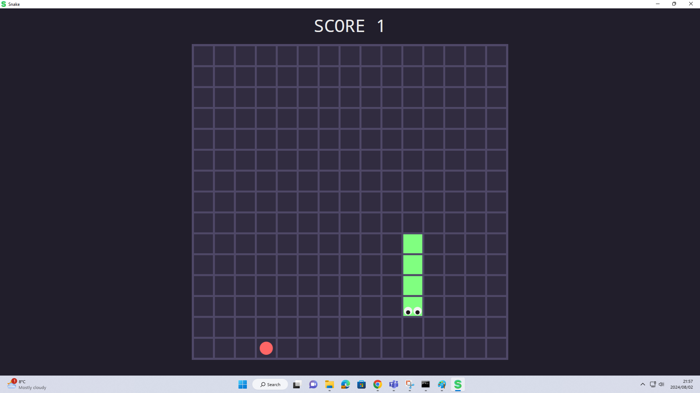

# Snake Game

This project implements a simple Snake game in C# using WPF (Windows Presentation Foundation). The game includes features such as controlling the snake with arrow keys, collecting food, and scoring points.

## Setup

### Prerequisites

- Visual Studio (or any C# IDE with .NET support)
- .NET Framework

### Installation

1. Clone the repository:
   ```bash
   git clone https://github.com/your/repository.git

2. Open the solution in Visual Studio.

3. Build and run the project.

## Game Overview

The game consists of several key components:

### Direction Class

Defines movement directions (`Left`, `Right`, `Up`, `Down`) for the snake.

### GameState Class

Manages the game state, including the grid, snake movement, scoring, and game over conditions.

### Images Class

Loads and provides images for game elements such as the snake, food, and grid.

### Position Class

Represents a position on the game grid and provides methods for translating positions based on direction.

### Window1 Class

The main game window that handles user input, updates game state, and renders the game grid and snake using WPF controls.

## How to Play

- Use arrow keys (`Up`, `Down`, `Left`, `Right`) to change the snake's direction.
- The snake grows when it eats food represented by a red block.
- Avoid hitting the walls or the snake's own body, as this will end the game.
- The game starts when any arrow key is pressed after the "PRESS ANY KEY TO START" message appears.

## Screenshots



## Contributing

Contributions are welcome! Please fork the repository and submit a pull request with your improvements.

## License

This project is licensed under the MIT License - see the [LICENSE](LICENSE) file for details.

## Acknowledgments

- This game was developed as a project for learning C# and game development with WPF.
- Thanks to [SharpDevelop](https://www.icsharpcode.net/) for the code snippets used in this project.

